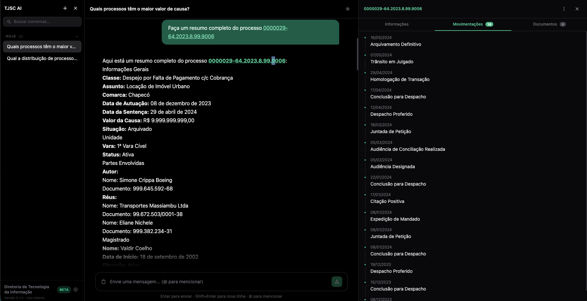

# TJSC AI — Agente de Consulta Processual

> Desafio de Entrega — Processo Seletivo · Diretoria de Tecnologia da Informação / TJSC  
> **Candidato a Líder de Produtos de IA · Breno Thales**

Chat de IA que responde, em linguagem natural, perguntas sobre processos judiciais de um banco SQLite sintético fornecido pelo TJSC. O agente consulta o banco de forma autônoma, preserva contexto entre turnos e indica os dados usados em cada resposta.



---

## Funcionalidades

- **Consulta conversacional** — perguntas em português sobre processos, partes, magistrados e movimentações
- **Painel de processo** — ao clicar em qualquer número CNJ na resposta, abre painel lateral com informações, movimentações e documentos
- **Insights com cache** — resumo, análise de risco e timeline de processos cacheados no Redis (TTL 1h) para evitar chamadas repetidas ao LLM
- **Minuta de sentença** — geração assistida por IA disponível exclusivamente para processos em andamento
- **Memória de conversa** — contexto preservado entre turnos via MongoDB (janela de 20 mensagens)
- **Streaming em tempo real** — respostas via SSE, token a token
- **Guardrails em 5 camadas** — proteção contra injeção de prompt, vazamento de dados sensíveis e abuso de SQL
- **Menção de processos** — digite `@` no chat para buscar e mencionar processos por número

---

## Tecnologias e Versões

| Camada | Tecnologia | Versão |
|---|---|---|
| LLM | OpenAI GPT-4o-mini | — |
| Agent / Backend | Spring Boot | 4.1.1 |
| Agent / Backend | Spring AI | 2.0.1 |
| Agent / Backend | Java | 25 |
| Agent / Backend | Maven (via wrapper) | 3.x (incluído) |
| Banco de dados | SQLite · MongoDB · Redis | — |
| Frontend | Angular | 21 |
| Frontend | Node.js | ≥ 22 |
| Frontend | pnpm | 10.15.0 |
| Infraestrutura | Docker Compose | ≥ 2.20 |

---

## Arquitetura


---

## Pré-requisitos

- Docker e Docker Compose ≥ 2.20
- Chave de API da OpenAI (`OPENAI_API_KEY`)
- Arquivo `desafio.sqlite` fornecido pelo TJSC

---

## Como executar (Docker — recomendado)

### 1. Configurar variáveis de ambiente

```bash
cp .env.example .env
# edite o .env e preencha o OPENAI_API_KEY
```

### 3. Subir os serviços

```bash
docker compose up --build
```

> `--build` é necessário apenas na primeira execução.

### 4. Acessar o chat

```
http://localhost:4200
```

Aguarde cerca de 1–2 minutos para todos os serviços ficarem saudáveis.

---

## Como executar sem Docker

### Pré-requisitos locais

| Ferramenta | Versão mínima | Instalação |
|---|---|---|
| Java (JDK) | 25 | [adoptium.net](https://adoptium.net) |
| Maven | 3.9+ | incluído via `mvnw` em cada serviço |
| Node.js | 22 | [nodejs.org](https://nodejs.org) |
| pnpm | 10.15.0 | ver abaixo |
| MongoDB | 7+ | [mongodb.com](https://www.mongodb.com/try/download/community) |
| Redis | 7+ | [redis.io](https://redis.io/downloads) |

#### Instalar o pnpm

```bash
# via corepack (recomendado, já incluso no Node 22+)
corepack enable
corepack prepare pnpm@10.15.0 --activate

# ou via npm
npm install -g pnpm@10.15.0
```

### Sequência de inicialização

Os serviços têm dependências entre si — respeite a ordem abaixo:

**1. process-data-service** (porta 8081) — não tem dependências externas além do SQLite:

```bash
cd backend/process-data-service
./mvnw spring-boot:run
```

**2. process-mcp-server** (porta 8082) — depende do `process-data-service`:

```bash
cd backend/process-mcp-server
./mvnw spring-boot:run
```

**3. process-agent** (porta 8083) — depende do MCP server, MongoDB e Redis:

```bash
cd backend/process-agent
OPENAI_API_KEY=sk-... ./mvnw spring-boot:run
```

> Variáveis que o agent espera:
> ```
> OPENAI_API_KEY=<sua chave>
> MONGODB_HOST=localhost        # default
> MONGODB_PORT=27017            # default
> REDIS_HOST=localhost          # default
> MCP_SERVER_URL=http://localhost:8082
> ```

**4. Frontend** (porta 4200):

```bash
cd frontend/tjsc-ai
pnpm install
pnpm start
```

---

## Serviços, portas e painéis

| Serviço | Porta | Descrição | Swagger / UI |
|---|---|---|---|
| `frontend` | 4200 | Interface de chat | — |
| `process-agent` | 8083 | Agente conversacional | [Boot UI](http://localhost:8083/bootui) |
| `process-mcp-server` | 8082 | 14 ferramentas MCP | [Boot UI](http://localhost:8082/bootui) |
| `process-data-service` | 8081 | API REST sobre o SQLite | [Swagger UI](http://localhost:8081/swagger-ui.html) · [Boot UI](http://localhost:8081/bootui) |
| MongoDB | 27017 | Memória das conversas e minutas | [Mongo Express](http://localhost:8084) |
| Redis | 6379 | Cache de respostas | [Redis Insight](http://localhost:8001) |

> **Boot UI** é o painel de administração embutido do Spring Boot (health, beans, métricas, env).  
> **Swagger UI** do `process-data-service` documenta todos os endpoints REST com possibilidade de execução interativa.

---

## Capacidades do agente

| # | Requisito do desafio | Implementação |
|---|---|---|
| 1 | Entender perguntas em português | GPT-4o-mini com system prompt jurídico |
| 2 | Consultar o banco de forma autônoma | 14 ferramentas MCP chamadas pelo LLM |
| 3 | Indicar os dados usados na resposta | Instrução explícita no system prompt |
| 4 | Preservar contexto entre turnos | ChatMemory em MongoDB (janela 20 msgs) |
| 5 | Reconhecer limites dos dados | System prompt + ferramentas retornam `found: false` |

---

## Documentação técnica (Knowledge Base)

> Base de conhecimento gerada durante o desenvolvimento — TJSC AI · Diretoria de Tecnologia da Informação.

| Conceito | Descrição |
|---|---|
| [Arquitetura de Infraestrutura](knowledge/reference/architecture-infra.md) | Topologia Docker, portas, volumes e dependências |
| [Process Agent](knowledge/services/process-agent.md) | Agente Spring AI — advisors, guardrails, streaming |
| [Process MCP Server](knowledge/services/process-mcp-server.md) | 14 ferramentas MCP e contrato Streamable HTTP |
| [Process Data Service](knowledge/services/process-data-service.md) | API REST somente leitura sobre o SQLite |
| [Frontend TJSC AI](knowledge/services/frontend-tjsc-ai.md) | Angular 21, signals, SSE, painel de processos |
| [Minuta Loop](knowledge/patterns/minuta-loop.md) | Pipeline de geração de minuta de sentença |
| [SSE Streaming](knowledge/patterns/sse-streaming.md) | Streaming de respostas via Server-Sent Events |
| [Advisor Chain](knowledge/patterns/advisor-chain.md) | Cadeia de advisors do Spring AI |
| [Guardrail em 5 Camadas](knowledge/patterns/guardrail-layers.md) | Proteção em defesa-em-profundidade |
| [Decisões arquiteturais](knowledge/decisions/) | Registro das decisões técnicas do projeto |

Visualização interativa do grafo de conhecimento: abra [`knowledge/viz.html`](knowledge/viz.html) no navegador.
