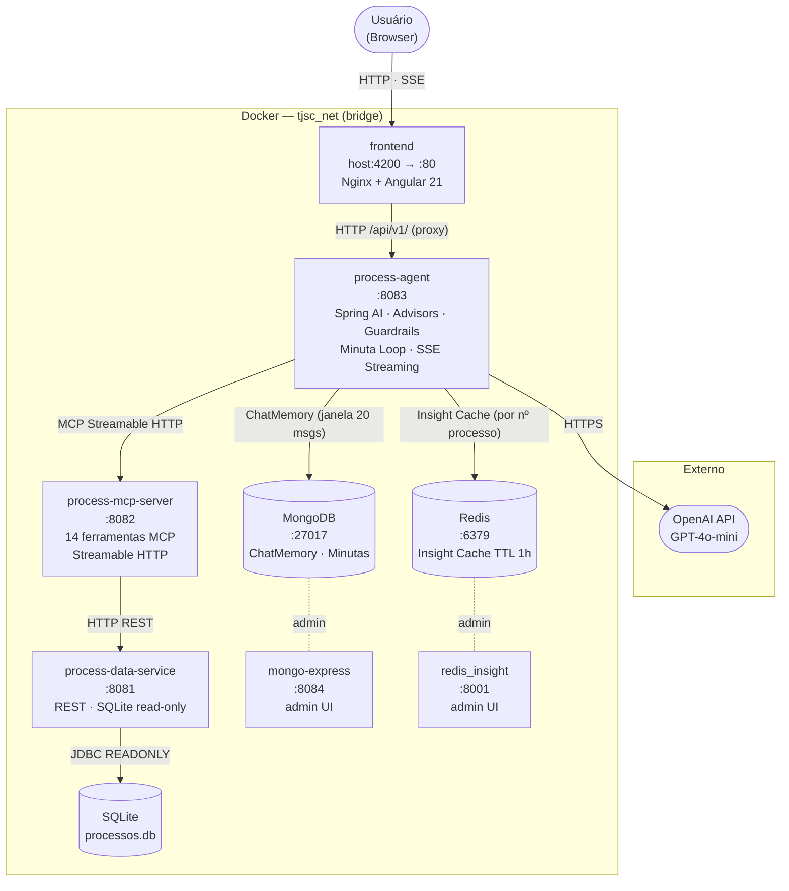

# TJSC AI — Agente de Consulta Processual

> Desafio de Entrega — Processo Seletivo · Diretoria de Tecnologia da Informação / TJSC  
> **Candidato a Líder de Produtos de IA · Breno Thales**

Chat de IA que responde, em linguagem natural, perguntas sobre processos judiciais de um banco SQLite sintético fornecido pelo TJSC. O agente consulta o banco de forma autônoma, preserva contexto entre turnos e indica os dados usados em cada resposta.

---

## Tecnologias

| Camada | Tecnologia |
|---|---|
| LLM | OpenAI GPT-4o-mini |
| Agent / Backend | Spring AI 1.0 + MCP Streamable HTTP |
| Banco de dados | SQLite (read-only) · MongoDB · Redis |
| Frontend | Angular 21 · Tailwind CSS · SSE Streaming |
| Infraestrutura | Docker Compose |

---

## Arquitetura



---

## Pré-requisitos

- Docker e Docker Compose
- Chave de API da OpenAI (`OPENAI_API_KEY`)
- Arquivo `desafio.sqlite` fornecido pelo TJSC

---

## Como executar

### 1. Copiar o banco de dados

```bash
cp desafio.sqlite backend/process-data-service/data/desafio.sqlite
```

### 2. Configurar variáveis de ambiente

```bash
cp .env.example .env
# edite o .env e preencha o OPENAI_API_KEY
```

### 3. Subir os serviços

```bash
docker compose up --build
```

> `--build` é necessário apenas na primeira execução.

### 4. Acessar o chat

```
http://localhost:4200
```

Aguarde cerca de 1–2 minutos para todos os serviços ficarem saudáveis.

---

## Serviços e portas

| Serviço | Porta | Descrição |
|---|---|---|
| `frontend` | 4200 | Interface de chat |
| `process-agent` | 8083 | Agente conversacional |
| `process-mcp-server` | 8082 | 14 ferramentas MCP |
| `process-data-service` | 8081 | API REST sobre o SQLite |
| MongoDB | 27017 | Memória das conversas e minutas |
| Redis | 6379 | Cache de respostas |
| Mongo Express | 8084 | Admin UI do MongoDB |
| Redis Insight | 8001 | Admin UI do Redis |

---

## Capacidades do agente

| # | Requisito do desafio | Implementação |
|---|---|---|
| 1 | Entender perguntas em português | GPT-4o-mini com system prompt jurídico |
| 2 | Consultar o banco de forma autônoma | 14 ferramentas MCP chamadas pelo LLM |
| 3 | Indicar os dados usados na resposta | Instrução explícita no system prompt |
| 4 | Preservar contexto entre turnos | ChatMemory em MongoDB (janela 20 msgs) |
| 5 | Reconhecer limites dos dados | System prompt + ferramentas retornam `found: false` |

---

## Documentação técnica (Knowledge Base)

> Base de conhecimento gerada durante o desenvolvimento — TJSC AI · Diretoria de Tecnologia da Informação.

| Conceito | Descrição |
|---|---|
| [Arquitetura de Infraestrutura](knowledge/reference/architecture-infra.md) | Topologia Docker, portas, volumes e dependências |
| [Process Agent](knowledge/services/process-agent.md) | Agente Spring AI — advisors, guardrails, streaming |
| [Process MCP Server](knowledge/services/process-mcp-server.md) | 14 ferramentas MCP e contrato Streamable HTTP |
| [Process Data Service](knowledge/services/process-data-service.md) | API REST somente leitura sobre o SQLite |
| [Frontend TJSC AI](knowledge/services/frontend-tjsc-ai.md) | Angular 21, signals, SSE, painel de processos |
| [Minuta Loop](knowledge/patterns/minuta-loop.md) | Pipeline de geração de minuta de sentença |
| [SSE Streaming](knowledge/patterns/sse-streaming.md) | Streaming de respostas via Server-Sent Events |
| [Advisor Chain](knowledge/patterns/advisor-chain.md) | Cadeia de advisors do Spring AI |
| [Guardrail em 5 Camadas](knowledge/patterns/guardrail-layers.md) | Proteção em defesa-em-profundidade — input · tool · output no agente + SqlController · JDBC read-only no data service |
| [Decisões arquiteturais](knowledge/decisions/) | Registro das decisões técnicas do projeto |

Visualização interativa do grafo de conhecimento: abra [`knowledge/viz.html`](knowledge/viz.html) no navegador.
