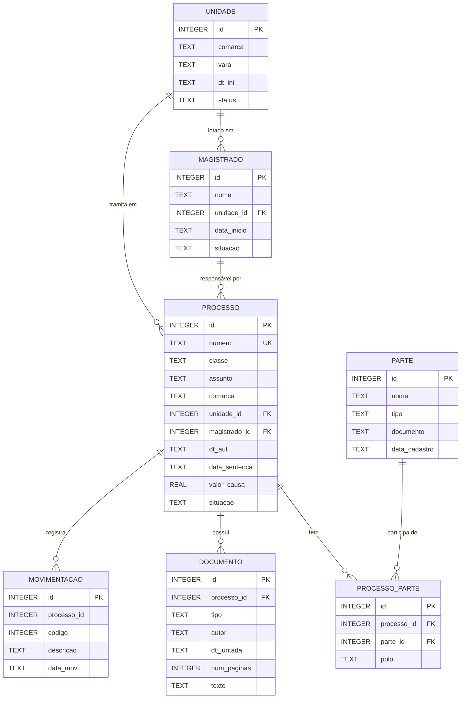

# DATA_MODEL.md — Modelo de Dados do Banco SQLite

> Banco: `desafio.sqlite` — dados sintéticos do TJSC (Tribunal de Justiça de Santa Catarina)

---

## Diagrama de Relacionamentos



---

## Tabelas

### `processo`

Entidade central do domínio. Cada linha representa um processo judicial.

| Coluna         | Tipo    | Restrição | Descrição                                |
|----------------|---------|-----------|------------------------------------------|
| `id`           | INTEGER | PK        | Identificador interno                    |
| `numero`       | TEXT    | NOT NULL, UNIQUE | Número CNJ do processo (formato: `NNNNNNN-DD.AAAA.J.TT.OOOO`) |
| `classe`       | TEXT    | NOT NULL  | Classe processual (ex: Procedimento Comum Cível) |
| `assunto`      | TEXT    |           | Assunto principal do processo            |
| `comarca`      | TEXT    |           | Nome da comarca                          |
| `unidade_id`   | INTEGER | FK → unidade.id | Vara/unidade onde tramita          |
| `magistrado_id`| INTEGER | FK → magistrado.id | Magistrado responsável           |
| `dt_aut`       | TEXT    |           | Data de autuação (distribuição)          |
| `data_sentenca`| TEXT    |           | Data da sentença (nullable)              |
| `valor_causa`  | REAL    |           | Valor da causa em reais (nullable)       |
| `situacao`     | TEXT    |           | Situação do processo (vide observações)  |

**Registros:** 10.000

**Observação sobre `situacao`:** Os valores estão inconsistentes no banco (ex: `julgado`, `Julgado`, `JULGADO`, `em andamento`, `EM ANDAMENTO`, `Arquivado`, `ARQUIVADO`, `Suspenso`). A API retorna o valor exato do banco sem normalização, cabendo ao consumidor tratar case-insensitively.

---

### `parte`

Pessoas físicas ou jurídicas que participam do processo.

| Coluna          | Tipo    | Restrição | Descrição                             |
|-----------------|---------|-----------|---------------------------------------|
| `id`            | INTEGER | PK        | Identificador interno                 |
| `nome`          | TEXT    | NOT NULL  | Nome completo                         |
| `tipo`          | TEXT    |           | Papel original: `autor`, `réu`, `ativo`, `passivo` |
| `documento`     | TEXT    |           | CPF (111.222.333-44) ou CNPJ          |
| `data_cadastro` | TEXT    |           | Data de cadastro no processo          |

**Registros:** 14.966

---

### `processo_parte`

Tabela de junção entre `processo` e `parte`. Representa a participação de uma parte em um processo específico.

| Coluna        | Tipo    | Restrição       | Descrição                          |
|---------------|---------|-----------------|------------------------------------|
| `id`          | INTEGER | PK              | Identificador interno              |
| `processo_id` | INTEGER | FK → processo.id | Processo                          |
| `parte_id`    | INTEGER | FK → parte.id   | Parte participante                 |
| `polo`        | TEXT    |                 | Polo processual: `ativo`, `passivo` |

**Registros:** 25.086  
**Índices:** `idx_pp_processo (processo_id)`, `idx_pp_parte (parte_id)`

---

### `magistrado`

Juízes e desembargadores do TJSC.

| Coluna        | Tipo    | Restrição       | Descrição                          |
|---------------|---------|-----------------|------------------------------------|
| `id`          | INTEGER | PK              | Identificador interno              |
| `nome`        | TEXT    | NOT NULL        | Nome completo do magistrado        |
| `unidade_id`  | INTEGER | FK → unidade.id | Unidade de lotação                 |
| `data_inicio` | TEXT    |                 | Data de início na unidade          |
| `situacao`    | TEXT    |                 | `ativo`, `aposentado`, etc.        |

**Registros:** 200

**Observação:** Não há tabela separada de `advogado`. As informações de advogado são derivadas do campo `documento.autor` onde o padrão é `"Nome — OAB/SC NNNNN"`.

---

### `documento`

Peças processuais juntadas ao processo.

| Coluna        | Tipo    | Restrição        | Descrição                               |
|---------------|---------|------------------|-----------------------------------------|
| `id`          | INTEGER | PK               | Identificador interno                   |
| `processo_id` | INTEGER | FK → processo.id | Processo ao qual pertence               |
| `tipo`        | TEXT    |                  | Tipo do documento (vide lista abaixo)   |
| `autor`       | TEXT    |                  | Autor/subscritor (advogado ou magistrado) |
| `dt_juntada`  | TEXT    |                  | Data de juntada                         |
| `num_paginas` | INTEGER |                  | Número de páginas (1–2 no banco)        |
| `texto`       | TEXT    |                  | Texto integral do documento             |

**Registros:** 25.582 (média: ~6,9 por processo, máximo: 19)  
**Índice:** `idx_doc_processo (processo_id)`

**Tipos de documento presentes:**
- Petição Inicial, Emenda à Inicial
- Despacho, Decisão Interlocutória, Decisão de Saneamento
- Sentença, Sentença Homologatória de Acordo
- Contestação, Réplica
- Certidão, Ata de Audiência
- Parecer do Ministério Público
- Apelação, Contrarrazões de Apelação
- Embargos de Declaração, Embargos à Execução Fiscal
- Exceção de Pré-Executividade
- Manifestação sobre Provas, Petição de Acordo

**Nota sobre `texto`:** A API **não expõe** o campo `texto` nos endpoints de listagem de documentos para evitar respostas massivas. A decisão está documentada em `DECISOES.md`.

---

### `movimentacao`

Histórico cronológico de movimentações processuais (tabela CNJ).

| Coluna        | Tipo    | Restrição | Descrição                                   |
|---------------|---------|-----------|---------------------------------------------|
| `id`          | INTEGER | PK        | Identificador interno                       |
| `processo_id` | INTEGER | (sem FK constraint) | Processo (não há REFERENCES declarado) |
| `codigo`      | INTEGER |           | Código CNJ da movimentação                  |
| `descricao`   | TEXT    |           | Descrição da movimentação                   |
| `data_mov`    | TEXT    |           | Data da movimentação                        |

**Registros:** 134.046 (média: ~13 por processo, máximo: 25)  
**Índice:** `idx_mov_processo (processo_id)`

**Nota:** A tabela `movimentacao` não declara `FOREIGN KEY REFERENCES processo(id)`, embora os dados sejam consistentes.

---

### `unidade`

Varas e unidades judiciárias do TJSC.

| Coluna    | Tipo    | Restrição | Descrição                     |
|-----------|---------|-----------|-------------------------------|
| `id`      | INTEGER | PK        | Identificador interno         |
| `comarca` | TEXT    | NOT NULL  | Nome da comarca               |
| `vara`    | TEXT    | NOT NULL  | Nome da vara                  |
| `dt_ini`  | TEXT    |           | Data de criação da unidade    |
| `status`  | TEXT    | NOT NULL  | `ativa`, `inativa`            |

**Registros:** 118

---

## Entidades Derivadas (sem tabela própria)

### `Advogado`

Derivado de `documento.autor` onde o campo contém o padrão `OAB/`:

```
"Dr. João Advogado — OAB/SC 12.345"
 └── nome: "Dr. João Advogado"
     oab:  "OAB/SC 12.345"
```

### `Decisão`

Derivada de `documento` com `tipo` em:
- `Sentença` (prioridade 1)
- `Sentença Homologatória de Acordo` (prioridade 2)
- `Decisão Interlocutória` (prioridade 3)
- `Decisão de Saneamento` (prioridade 4)

Retorna o documento de maior prioridade, desempatado por `dt_juntada DESC`.

### `Pedido` (mapeado de `Documento`)

Representado por documentos com `tipo` em:
- `Petição Inicial`
- `Emenda à Inicial`
- `Petição de Acordo`

---

## Índices Relevantes

| Índice             | Tabela          | Coluna(s)   | Observação                      |
|--------------------|-----------------|-------------|---------------------------------|
| `sqlite_autoindex_processo_1` | processo | numero | Índice único automático         |
| `idx_pp_processo`  | processo_parte  | processo_id | Usado em todas as queries de partes |
| `idx_pp_parte`     | processo_parte  | parte_id    | Útil em busca reversa por parte |
| `idx_doc_processo` | documento       | processo_id | Consultas de documentos por processo |
| `idx_mov_processo` | movimentacao    | processo_id | Consultas de movimentações por processo |

---

## Consultas Relevantes

### Buscar processo por número

```sql
SELECT id, numero, classe, assunto, comarca,
       unidade_id, magistrado_id, dt_aut, data_sentenca, valor_causa, situacao
FROM processo
WHERE numero = :numero
```

### Buscar partes de um processo

```sql
SELECT pa.id, pa.nome, pa.tipo, pa.documento, pa.data_cadastro, pp.polo
FROM parte pa
JOIN processo_parte pp ON pp.parte_id = pa.id
JOIN processo pr ON pr.id = pp.processo_id
WHERE pr.numero = :numero
ORDER BY pp.polo, pa.nome
```

### Buscar advogados (derivado de documentos)

```sql
SELECT d.id, d.autor, d.tipo, d.dt_juntada
FROM documento d
JOIN processo p ON p.id = d.processo_id
WHERE p.numero = :numero
  AND d.autor LIKE '%OAB/%'
ORDER BY d.dt_juntada
```

### Buscar movimentações (com paginação)

```sql
SELECT m.id, m.processo_id, m.codigo, m.descricao, m.data_mov
FROM movimentacao m
JOIN processo p ON p.id = m.processo_id
WHERE p.numero = :numero
ORDER BY m.data_mov DESC
LIMIT :size OFFSET :offset
```
