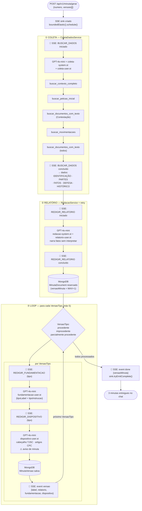
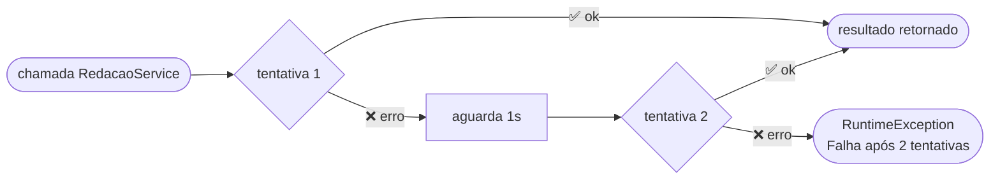

# Diagrama do Minuta Loop — Fluxo Sequencial

Pipeline executado em `Schedulers.boundedElastic()` — thread separada do request HTTP.
O sink SSE é criado **antes** de iniciar o loop.

## Fluxo completo

## Retry automático — `comRetry`

Aplicado em `relatorio`, `fundamentacao` e `dispositivo`. Não aplicado na coleta.

## Eventos SSE emitidos

| Evento | Quando | Payload chave |
|--------|--------|---------------|
| `step` | a cada sub-etapa iniciada/concluída | `acao`, `mensagem` |
| `versao` | ao concluir cada VersaoTipo | `label`, `relatorio`, `fundamentacao`, `dispositivo`, `steps[]` |
| `done` | pipeline completo | `versaoMinuta` (int — versão salva no MongoDB) |
| `erro` | exceção não tratada | mensagem de erro |
