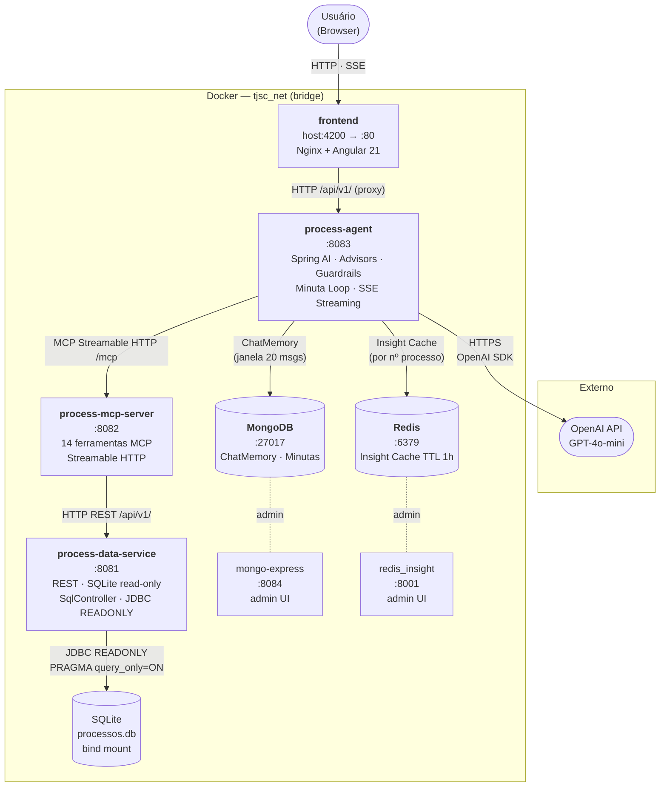

# Diagrama de Arquitetura — Infraestrutura Docker

Oito serviços na rede `tjsc_net` (bridge). O frontend é o único ponto de entrada do usuário; o process-agent é o único que fala com a OpenAI externamente.

## Topologia de Serviços

## Dependências (depends_on)

| Serviço | Aguarda |
|---------|---------|
| `mongo-express` | `mongodb` healthy |
| `redis_insight` | `redis` healthy |
| `process-mcp-server` | `process-data-service` healthy |
| `process-agent` | `mongodb` healthy · `redis` healthy · `process-mcp-server` started |
| `frontend` | `process-agent` started |

## Portas e Healthchecks

| Serviço | Porta | Healthcheck |
|---------|-------|-------------|
| `mongodb` | 27017 | `mongosh --eval "db.adminCommand('ping')"` |
| `mongo-express` | 8084 | — |
| `redis` | 6379 | `redis-cli ping` |
| `redis_insight` | 8001 | — |
| `process-data-service` | 8081 | `curl /actuator/health` |
| `process-mcp-server` | 8082 | — |
| `process-agent` | 8083 | — |
| `frontend` | 4200→80 | — |

## Volumes

| Volume | Usado por | Conteúdo |
|--------|-----------|----------|
| `./backend/mongodb:/data/db` | mongodb | dados persistentes (bind mount) |
| `redis_volume_data` | redis | dados do cache |
| `redis_insight_volume_data` | redis_insight | config do painel |

## Variáveis de ambiente principais (process-agent)

| Variável | Destino |
|----------|---------|
| `SPRING_AI_OPENAI_API_KEY` | OpenAI API |
| `SPRING_DATA_MONGODB_URI` | `mongodb://mongodb:27017/tjsc` |
| `SPRING_DATA_REDIS_HOST` | `redis` |
| `MCP_SERVER_URL` | `http://process-mcp-server:8082/mcp` |
